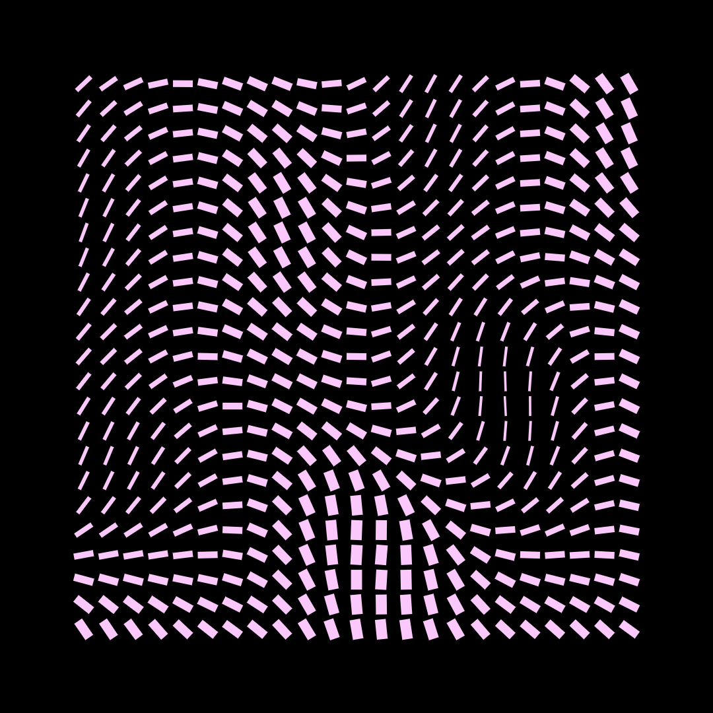
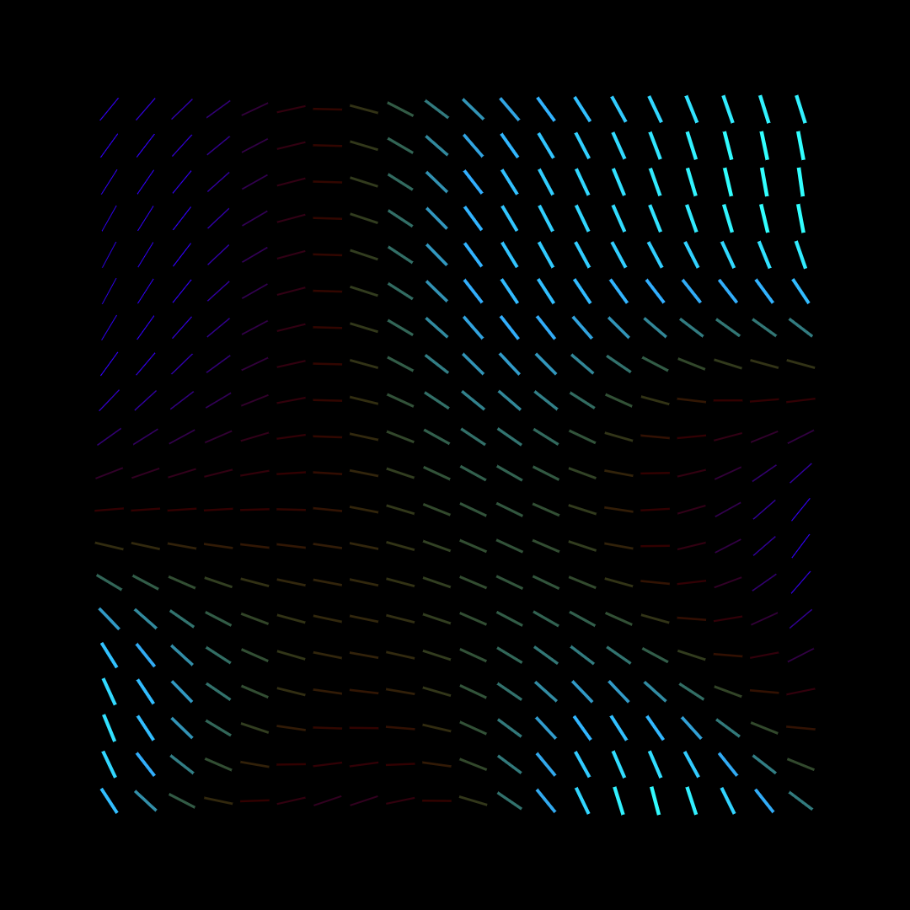
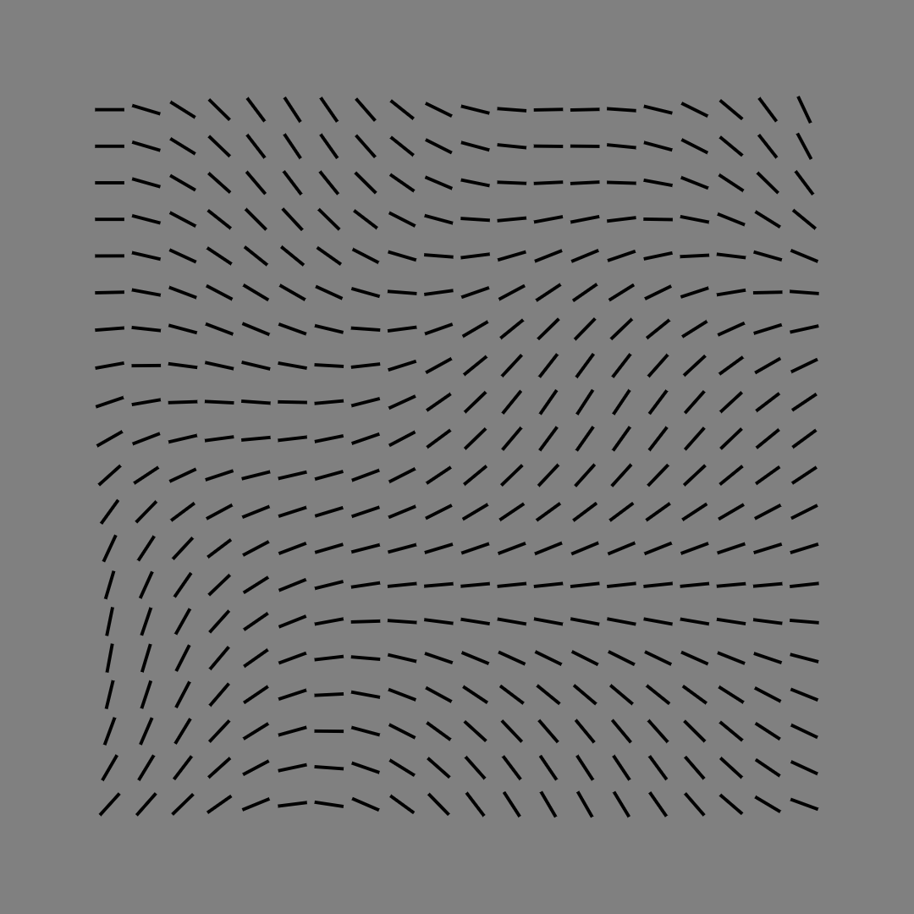
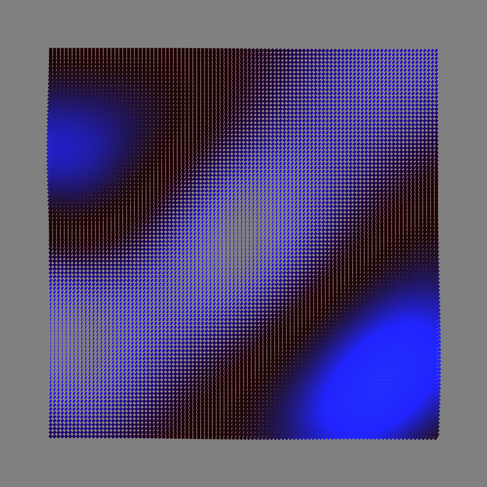
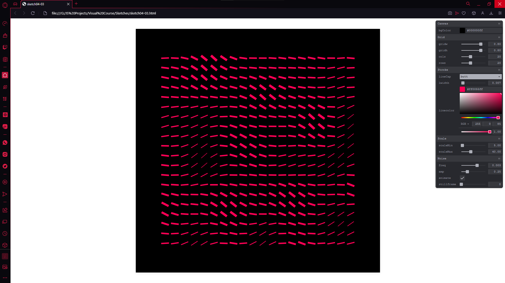
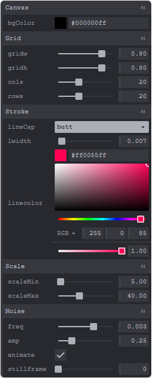

### Noise-Animated-Sketch

`Noise-Animated-Sketch` is an Animated Sketch made with Java Script with help of Canvas-Sketch and Teakpane.

- :closed_book: [Documentation](./docs/README.md)

#

  screenshots of <code>Noise-Animated-Sketch</code> extracted with canvas-sketch save settings

  ↓ 

  

  

  

  

  screenshots of <code>Noise-Animated-Sketch</code> and <code>Teakpane</code> running on operaGX

  ↓ 

  

### Teakpane

	<a href="https://cocopon.github.io/tweakpane/" target="_blank" align="left" >
			'Tweakpane WebSite'
	</a>
  

  With help of Tweakpane we can change our values live and have them ready to go!

  
  

  

  
  
  
    
